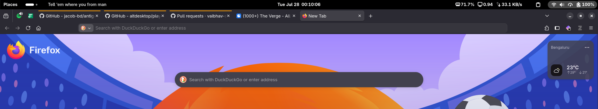

<div align="center">
  <h1>Bars</h1>
  <p><b>A beautifully native GNOME Shell Extension that displays synchronized lyrics in your top bar.</b></p>
  
</div>

<br>

**Bars** is a lightweight, zero-latency GNOME extension that instantly syncs the lyrics of the currently playing song and renders them right in your top panel. It's built for efficiency, leveraging an event-driven daemon that guarantees instantaneous updates without bloating your system.

## System Requirements & Compatibility

> [!WARNING]
> **Bars is exclusively built for GNOME 45 and newer.**
> It utilizes the modern GNOME ESM (ECMAScript Module) extension architecture, which completely replaced the legacy extension system.
> 
> If you are on an older LTS release like **Ubuntu 22.04** (which uses GNOME 42), the extension will silently fail to load because your system does not support modern GNOME extensions. Ensure you are on a recent OS like Ubuntu 24.04, Fedora 39+, or Arch Linux.

---

## Features

- **Zero Latency Engine**: Powered by a custom Python daemon using asynchronous I/O streams. The lyrics update the millisecond the song advances.
- **Universal Support**: Works seamlessly out of the box with Firefox, Spotify, Chrome, or any MPRIS-compatible media player.
- **Synchronized Perfection**: Fetches highly accurate, time-synced `.lrc` lyrics from the [lrclib.net](https://lrclib.net/) open API.
- **Native Aesthetic**: Carefully designed to look and feel like a first-class GNOME citizen, cleanly integrated into the top bar.

---

## Installation Guide

We've made installing **Bars** as simple as possible for Linux users. You can either use the provided installation script or use `make` to package it yourself.

### Option A: One-Click Install Script (Recommended)
If you have cloned or downloaded this repository, simply run the installation script:
```bash
./install.sh
```
This script will automatically package the extension into a `.zip` file and install it to your local GNOME Shell extensions directory.

### Option B: Using Make
If you prefer standard build tools, a `Makefile` is provided:
```bash
# Packages and installs the extension
make install
```

### Option C: Manual Packaging
If you want to package it manually for distribution:
```bash
zip -q bars@vaibhav-sri.github.com.zip bars.py extension.js metadata.json stylesheet.css README.md
gnome-extensions install bars@vaibhav-sri.github.com.zip --force
```

### Reloading the Extension
GNOME Shell requires a session reload to load newly installed extensions safely:
1. **Log out of your user session and log back in.** (If you are on X11, simply press `Alt+F2`, type `r`, and hit `Enter`).
2. The extension is automatically enabled by the install script. You should see it in your top panel immediately after logging back in!

*(Note: If you packaged and installed it manually using `zip`, you will need to run `gnome-extensions enable bars@vaibhav-sri.github.com` before reloading.)*

## Architecture & Documentation

To understand the core design, sequence diagrams, and how the Python daemon communicates with GNOME Shell, please read our [Architecture Documentation](docs/architecture.md).

---

## Architecture Deep-Dive

To prevent the overhead and lag of repeatedly running scripts (a common pitfall in other extensions), **Bars** employs a long-running background daemon (`bars.py`). 

The daemon continuously polls the MPRIS interface using a lightweight `100ms` loop and flushes lyric changes directly to `stdout`. The GNOME Shell frontend (`extension.js`) uses `Gio.Subprocess` to hook into this output stream via `Gio.DataInputStream`. This completely eliminates process spawning overhead and provides true real-time synchronization.

---

## Development & Testing

We maintain a strict, comprehensive test suite to ensure edge cases (e.g., malformed `.lrc` files, corrupted local caches, missing metadata, and API rate limits) are handled gracefully without ever crashing the shell.

### Setting up checks
Install the required testing and linting packages:
```bash
python3 -m pip install --user pytest flake8 autopep8
```

### Running Unit Tests
Execute the test suite to verify the core daemon logic:
```bash
python3 -m pytest test_bars.py
```

### Linting & Formatting
Ensure the codebase remains clean and adheres to PEP-8 standards:
```bash
# Check for linting errors
python3 -m flake8 bars.py test_bars.py

# Auto-format code
python3 -m autopep8 --in-place --aggressive --aggressive bars.py test_bars.py
```

---

<div align="center">
  Built for the GNOME Desktop.
</div>
