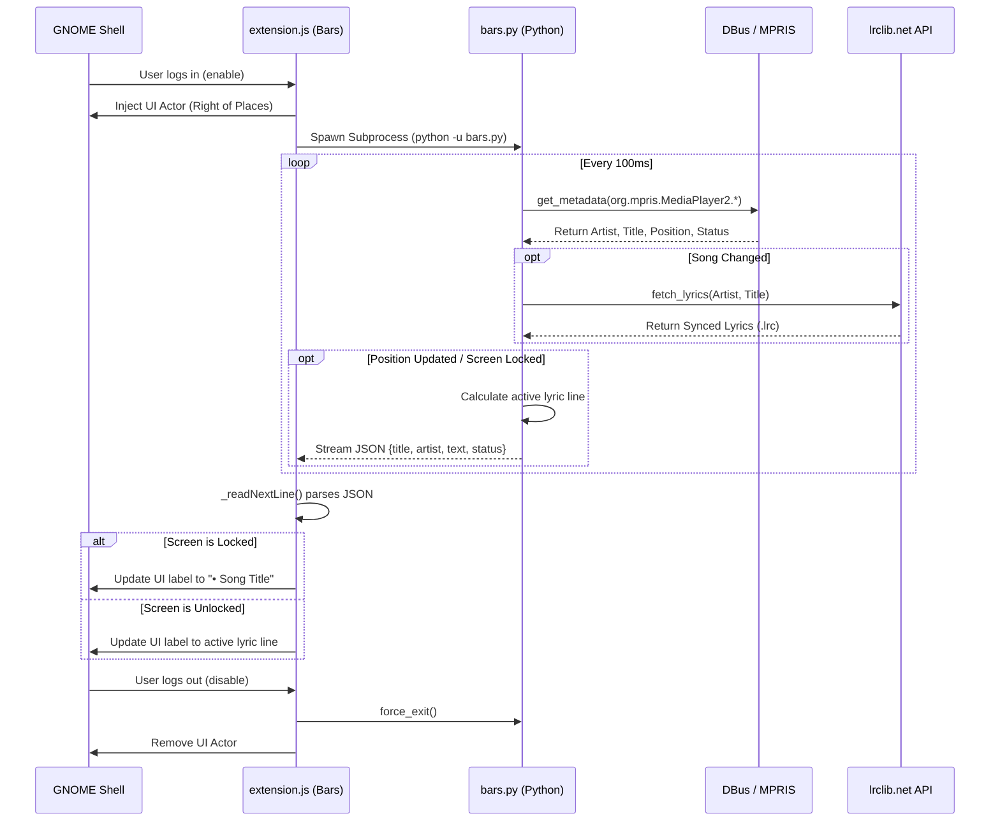

# Bars Architecture

Bars uses a split-architecture design to ensure zero-latency lyrics synchronization without blocking the main GNOME Shell thread.

## Component Overview

1. **GNOME Shell Frontend (`extension.js`)**: Runs in the GNOME Shell UI thread. Handles UI rendering, lifecycle management, and listening to the `stdout` stream of the python daemon.
2. **Python Daemon (`bars.py`)**: A long-running background process that polls MPRIS for playback updates, fetches lyrics from lrclib.net, parses the synced `.lrc` timestamps, and streams JSON updates to `stdout`.

## Sequence Diagram

Below is the sequence diagram illustrating the lifecycle and communication flow of the extension:

## Resilience and Fallbacks

1. **Auto-Recovery**: If the DBus connection breaks (e.g., during suspend/resume), `bars.py` tracks consecutive errors. After 50 errors, it intentionally crashes `sys.exit(1)`. `extension.js` catches the EOF event and automatically respawns the daemon after a 5-second backoff.
2. **Fuzzy Search API**: If the music player provides messy metadata (e.g., appended `(Remastered)` strings), the strict `api/get` match on lrclib.net may return `404 Not Found`. `bars.py` catches this and seamlessly falls back to `api/search`, providing fuzzy matching to guarantee lyrics are found.
3. **Robust Positioning**: GNOME extensions load asynchronously. To ensure `Bars` stays permanently pinned to the right of the left box, it listens to the `actor-added` signal on `_leftBox` and re-inserts itself to the end of the list automatically.
